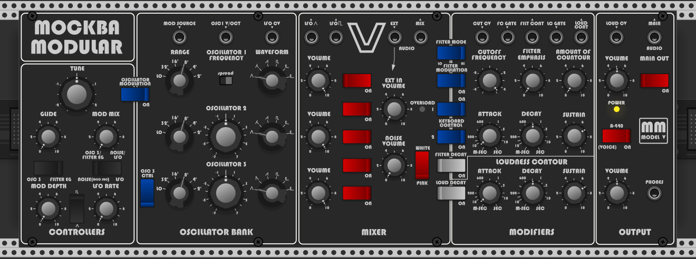

# MM_ModelV - Virtual Analog Synth for VCV Rack
A tribute to a famous synthesizer from the 70's

This plugin is a virtual tribute to one famous synthesizer from the 70's, yes, that one that just came to your mind. 
It brings together the Maug oscillators, the Filtah and other Mockba Modular components to create a full featured 3-Oscillator synthesizer.

This plugin has a few advantages over the original, being polyphony one of them most interesting. Which makes it capable of very rich pad and strings sounds.

## Videos
Playing with the very first version - https://www.youtube.com/watch?v=Dj0PI8nnWGs 
Two copies playing together - https://www.youtube.com/watch?v=V68fIWNYj5s

Make sure to check also my free line of modules: MockbaModular
https://github.com/MockbaTheBorg/MockbaModular
