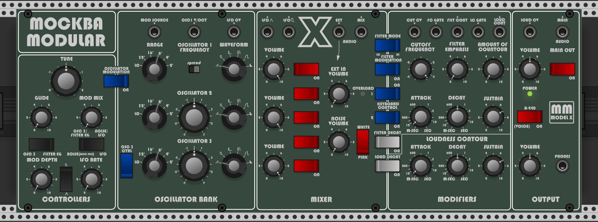

# MM_ModelX - Virtual Analog Hybrid Synth for VCV Rack
A crossover between two famous synthesizers

This plugin is a cross between two famous synthesizers, one from the 70's and one from the 80's. 
It brings together the Maug oscillators, the CZ oscillators, the Filtah and other Mockba Modular components to create a full featured 3-Oscillator synthesizer.

This plugin has a few advantages over the original, being polyphony one of the most interesting. Which makes it capable of very rich pad and strings sounds.

## Videos

Make sure to check also my free line of modules: MockbaModular
https://github.com/MockbaTheBorg/MockbaModular
