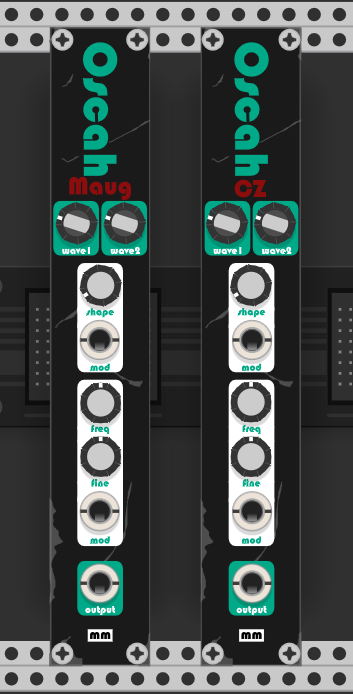

# MM_Oscah
Vintage style oscillators for VCV Rack by Mockba the Borg



This oscillator collection contains a Casio CZ based oscillator with wave sequencing, and a Moog based oscillator also with wave sequencing, which allows for the creation of sounds that the original minimoog wasn't able to.<br>
The oscillators have selectors for the wave types on each of the two cycles as well as modulated shaping and v/oct modulated frequency.

The wave knobs select which wave is going the be on each wave sequence step, meaning, if a saw and a square are selected, the output wave will have one saw cycle, then a square cycle, then saw again and so on.<br>
This wave sequencing was a feature of the original Casio synthesizers, and has been added to the Maug oscillator as well, which allows very interesting sound combinations.

The waveforms on the CZ oscillator are:
```
0 - Saw
1 - Square
2 - Pulse
3 - Double Sine
4 - Saw Pulse
5 - Resonant 1
6 - Resonant 2
7 - Resonant 3
```

The waveforms on the Maug oscillator are:
```
0 - Triangle
1 - Shark Tooth
2 - Saw
3 - Square .48
4 - Square .29
5 - Square .17
6 - Inverted Saw
```

On the CZ oscillator the shape knob controls the magnitude of phase distortion that is applied to the oscillator, which on the Casio CZ was called DCW. On the Maug oscillator the shape knob actually applies a low pass filter with a slight amount of resonance.<br>
The low pass filter is also modeled after the Moog 4-pole low pass filter.

If the shape modulation input is connected the shape knob works as attenuation for the shape modulation signal.

The oscillators are both mathematical replicas of the original waveforms and sound very much like the originals.<br>
They can be combined to create very interesting 2 or 3 oscillator synths.<br>
They can also be combined with the other MockbaModular modules to build much more complex synth designs.
