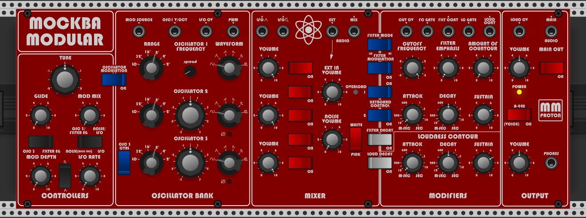

# MM_Proton - Virtual Analog Synth for VCV Rack
Custom VA synth for VCV Rack

This plugin implements new anti-aliased oscillators, with different waveforms and a few features like variable PWM and phase inversion.
The filter is also upgraded to have Low-Pass, High-Pass and Band-Pass modes.

This new set of oscillators allows for a completely different set of sounds than the other two plugins of the same series.

## Videos

Practical Playing with Proton's Presets: https://www.youtube.com/watch?v=MM_qn97sR90

Make sure to check also my free line of modules: MockbaModular
https://github.com/MockbaTheBorg/MockbaModular