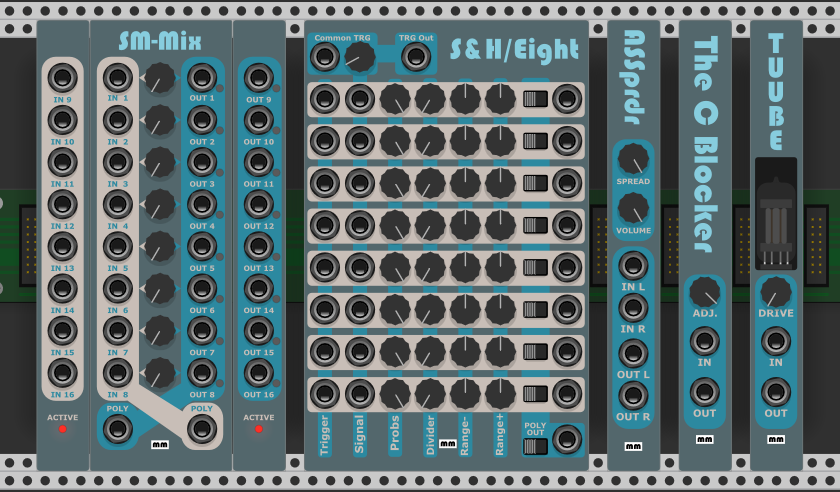

# MM_Tools - Extra Free Toolset for VCV Rack
A new set of free tools for VCV Rack

## SMMix
SMMix is a poly splitter/merger with a (knob) twist.

## SHEight
SHEight is a set of 8 S&H on a single module.

## ASSprdr
ASSprdr is a stereo spreader for poly signals.

## Tuube
Tuube is a simple saturator to immitate tube distortion.

Make sure to check also my free line of modules: MockbaModular
https://github.com/MockbaTheBorg/MockbaModular