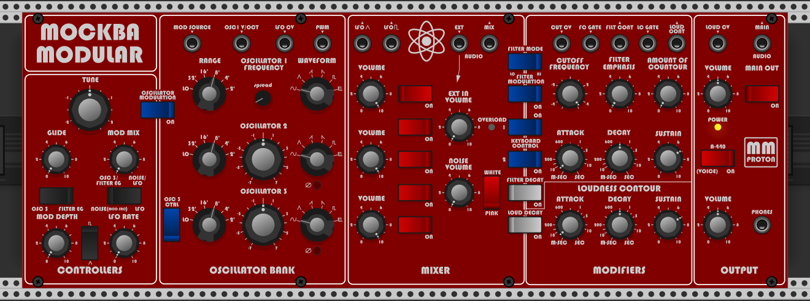

# VCVProducts
Information about my commercial and closed-source plugins for VCV Rack: https://vcvrack.com/plugins#Mockba

### MM_ModelV
Emulation of the Minimoog Model D. 

### MM_ModelX
Basically a Moog Model D with Casio CZ oscillators on it. 

### MM_Proton
Third iteration of the "Model" series, with PWM, different VCOs and filter. 

### MM_Oscah
Emulation of the vintage Casio CZ (phase distortion) and Moog oscillators. Plus an extra. 

### MM_Tools
Set of free tools for VCV Rack. 

## Youtube
Check my Youtube channel as I will start adding videos there showcasing the Mockba Modular modules 
https://www.youtube.com/channel/UCEgDINz-Mt1U10gwqInULOQ
